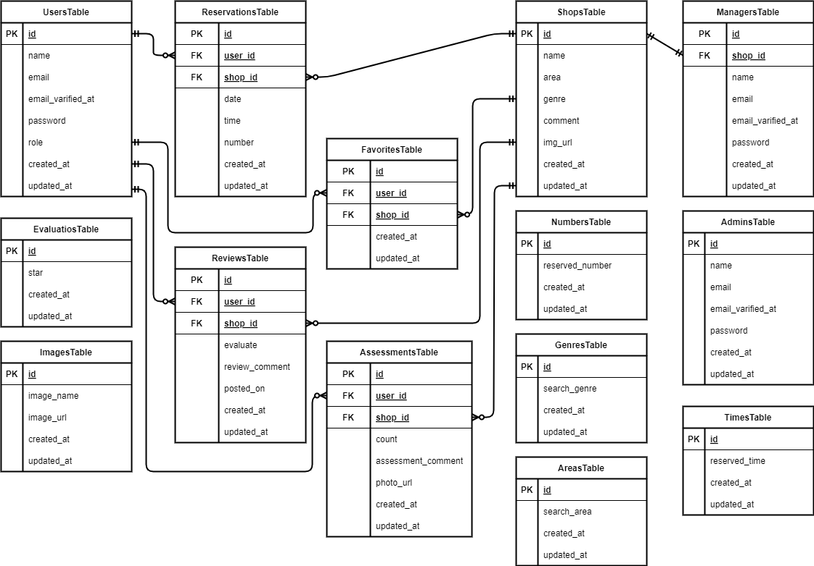

# RESE

飲食店予約サービスアプリケーションです。ユーザー登録無しでも店舗情報の閲覧は可能ですが、登録していただくと来店予約やお気に入り店舗のチェック等の機能をご利用可能になります。

## 作成した目的

クライアントより自社で予約サービスを持ちたいとの要望があった為、要望に添った機能を持つ予約サービスを構築するため作成しました。

## アプリケーションURL

### ローカル環境

http://localhost

### AWSを使用した本番環境

http://18.183.142.255

## 機能一覧

・アカウント作成機能

・アカウント作成時のメール認証機能

・ログイン及びログアウト機能

・飲食店一覧表示機能

・飲食店詳細表示機能

・店舗検索機能

・飲食店お気に入り情報追加機能

・飲食店お気に入り情報削除機能

・飲食店予約情報追加機能

・飲食店予約情報更新機能

・飲食店予約情報削除機能

・飲食店レビュー作成機能

・飲食店レビュー閲覧機能

・ユーザー情報表示機能

・ユーザーお気に入り情報一覧表示機能

・ユーザー飲食店予約情報一覧表示機能

・決済機能

・管理者及び店舗代表者用管理画面ログイン・ログアウト機能

・店舗代表者アカウント作成機能

・店舗別予約情報表示機能

・予約者に対するお知らせメール送信機能

・予約者に対するリマインダーメール送信機能

・QRコード生成機能

・店舗情報新規作成機能

・店舗情報更新機能

・画像アップロード機能

## 使用技術

・Laravel 8

・nginx 1.21.1

・php 7.4.9

・html

・css

・mysql 8.0.26

## テーブル設計

## ER図

# 環境構築

### 1 Gitファイルをクローンする

git clone git@github.com:basstuba/atte.git

### 2 Dockerコンテナを作成する

docker-compose up -d --build

### 3 Laravelパッケージをインストールする

docker-compose exec php bash

でPHPコンテナにログインし

composer install

### 4 .envファイルを作成する

PHPコンテナにログインした状態で

cp .env.example .env

作成した.envファイルの該当欄を下記のように変更

DB_HOST=mysql

DB_DATABASE=laravel_db

DB_USERNAME=laravel_user

DB_PASSWORD=laravel_pass

MAIL_MAILER=smtp

MAIL_HOST=mail

MAIL_PORT=1025

MAIL_FROM_ADDRESS=tubatest@gmail.com

MAIL_FROM_NAME="${APP_NAME}"

**.envファイルの最後に追加**

STRIPE_KEY=pk_test_51PJHw4Cu4QmvhYr026GL6mQjf9nYC8Ag3AVVRhV6hCBZjPs5piclX08ryWMK7aqtwqr2utcrF9kOtvCSXhUlaZtg00gR2VSo6l

STRIPE_SECRET=sk_test_51PJHw4Cu4QmvhYr0gWJeBT5Y3eykIecyMylhbGbWWOjfs5lPEGwYAepNnTb5tCcvMiHpmK2J9nacwaRkM1iwSezE00id9dAMKm

### 5 テーブルの作成

docker-compose exec php bash

でPHPコンテナにログインし(ログインしたままであれば上記コマンドは実行しなくて良いです。)

php artisan migrate

### 6 ダミーデータ作成

PHPコンテナにログインした状態で

php artisan db:seed

### 7 アプリケーション起動キーの作成

PHPコンテナにログインした状態で

php artisan key:generate

### 8 cronの設定

phpコンテナに**ログインしていない**状態で

crontab -e

エディタが開いたら

&ast; &ast; &ast; &ast; &ast; cd アプリケーションまでの絶対パス && docker-compose exec php php artisan schedule:run >> /dev/null 2>&1

を登録（例）&ast; &ast; &ast; &ast; &ast; cd /home/nutka/coachtech/laravel/rese/src && docker-compose exec php php artisan schedule:run >> /dev/null 2>&1

## 各種機能について

### 飲食店お気に入り情報追加機能と飲食店予約情報追加機能

・ログインしていないユーザーが使用しようとするとログインページに遷移する仕様になっています。これはもしログインしないと機能しない仕様にするとユーザーにエラーと勘違いされるかもしれないと思ったのと登録していないユーザーへ登録を促す意味があります。

### 飲食店レビュー作成機能

・ユーザーがログインしている時のみ飲食店詳細ページにボタンが表示されます。

### 決済機能

・マイページに決済ボタンがあります。

### 管理者及び店舗代表者用管理画面ログイン機能

・専用のアカウントでログインすることによってメニュー画面にログイン画面へのリンクが表示されます。

**専用アカウント**

email -> coachtech@coachtech.com

password -> coachtech

### 管理者及び店舗代表者のアカウント

・管理者アカウント1件と店舗代表者アカウント20件を用意してあります。

**管理者アカウント**

email -> admin@admin.com

password -> administrator

**店舗代表者アカウント**

email -> manager-1@manager.com ~ manager-20@manager.com

password -> manager1 ~ manager20

・数字は案件シートの店舗データ一覧の上から順番に振り分けました。

（例）manager-1~のemailとpasswordは仙人の店舗代表者アカウント

**ログイン時はemailとpasswordの入力と役職の選択をしてください。**

### 店舗代表者用管理画面

・もし担当店舗が設定されていない店舗代表者アカウントでログインした場合は「店舗別予約情報表示機能」「予約者に対するお知らせメール送信機能」「店舗情報更新機能」は使用できません。

・あらかじめ用意したアカウント20件や管理者用管理画面で作成したアカウントでも担当店舗が設定されている場合は使用可能です。

### 予約者に対するお知らせメール送信機能

・担当店舗予約情報確認ページから使用できます。送信するお客様の氏名を選択し送信してください。

### QRコード

・「お知らせメール」と「リマインダーメール」にQRコードを送付しています。

## その他

### 1 新規登録時の認証メール、お知らせメール、リマインダーメールは**MailHog**へ送信されるように設定しています。

#### ローカル環境

http://localhost:8025

#### AWSを使用した本番環境

http://18.183.142.255:8025

### 2 データベースのテーブルを確認できるphpMyAdminのURLは下記の通りです。

#### ローカル環境

http://localhost:8080

#### AWSを使用した本番環境

http://18.183.142.255:8080

### 3 docker-compose.ymlの設定はlocalhostでの接続設定になっています。

### 4 AWSの環境の確認はIAMユーザーを選択して”アカウントID“ -> 471112662470,”ユーザーネーム” -> guest-user,”パスワード” -> G-user/4202でログインしてください。

リージョンは東京を選択すれば確認できます。

### 5 本番環境については採点が終了するまでEC2インスタンスを起動したままにしておきますので確認できると思います。